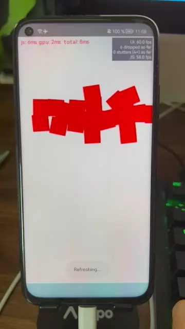

# react-native-box2d

> ⚠️🚧 This is WIP and not ready for production use. 🚧⚠️
>
> I am still actively developing this library.

JSI port of the [Box2D physics engine](https://box2d.org/) for React Native.

Use real world physics to build gestures, animations, games or anything else you can think of.



---

## Installation

### React Native

```sh
yarn add react-native-box2d
cd ios && pod install
```

## Usage

TODO: Add usage example

## Limitations

As the library uses JSI for synchronous native methods access, remote debugging (e.g. with Chrome) is no longer possible. Instead, you should use [Flipper](https://fbflipper.com).

## Thanks

- [react-native-jsi-library-template](https://github.com/mrousavy/react-native-jsi-library-template)
- [box2d](https://box2d.org/)
- [@shopify/react-native-skia](https://github.com/Shopify/react-native-skia)

## Contributing

See the [contributing guide](CONTRIBUTING.md) to learn how to contribute to the repository and the development workflow.

## License

MIT
